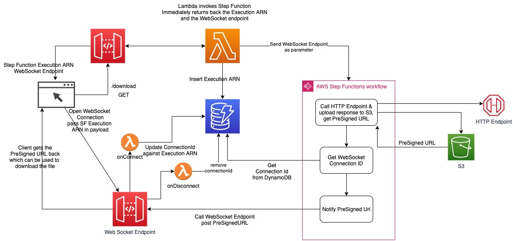
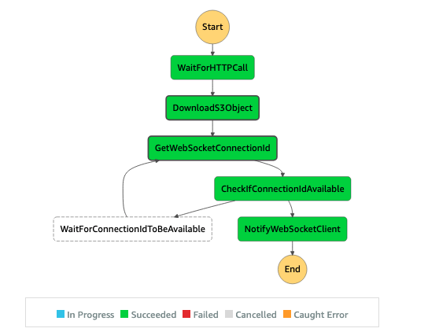

# Serverless App for Async file download

This is a sample serverless application which showcases an async approach to download files which can be larger than the payload size limit of API Gateway.
This architecture uses S3 PreSigned URL and WebSocket endpoint.

> `main` branch uses AWS JavaScript SDK v3.  
> `aws-sdk-v2` branch uses AWS JavaScript SDK v2.

## Rationale
Customers are interested in using API Gateway as a front door for their backend HTTP endpoints. API Gateway as a managed service provides a lot of benefits to customer, such as creating, publishing, maintaining, monitoring, and securing REST, HTTP, and WebSocket APIs at any scale. In some edge case scenarios, customers want to use API Gateway and Lambda integration but are limited to API Gateway’s 10 MB payload size, API Gateway’s 30 seconds timeout, and Lambda’s 6MB payload size for synchronous request/response.

One such scenario is when customers need to download large files from an HTTP Endpoint following a Serverless approach. An example of this is in the Financial industry, where some customers:

 - Need to download very large text or binary files to support business operations
 - Need to have security in place
 - Allows for lifecycle policies around these files
 - Want to build quickly and support scaling

## Solution
This project contains source code and supporting files for the below proposed architecture:


## Deploy the sample application

The AWS SAM CLI is an extension of the AWS CLI that adds functionality for building and testing Lambda applications. It uses Docker to run your functions in an Amazon Linux environment that matches Lambda. It can also emulate your application's build environment and API.

To use the AWS SAM CLI, you need the following tools:

* AWS SAM CLI - [Install the AWS SAM CLI](https://docs.aws.amazon.com/serverless-application-model/latest/developerguide/serverless-sam-cli-install.html).
* Node.js - [Install Node.js 14](https://nodejs.org/en/), including the npm package management tool.
* Docker - [Install Docker community edition](https://hub.docker.com/search/?type=edition&offering=community).

To build and deploy your application for the first time, run the following in your shell:

```bash
sam build
sam deploy --guided
```

The first command will build the source of your application. The second command will package and deploy your application to AWS, with a series of prompts. Provide below information for the first time:

```
Configuring SAM deploy
======================

  Looking for config file [samconfig.toml] :  Not found

  Setting default arguments for 'sam deploy'
  =========================================
  Stack Name [sam-app]: aws-serverless-file-download-app
  AWS Region [us-east-2]: 
  Parameter StageName [dev]: 
  Parameter BucketName []: <already created bucket name in the same region>
  # Shows you resources changes to be deployed and require a 'Y' to initiate deploy
  Confirm changes before deploy [y/N]: y
  # SAM needs permission to be able to create roles to connect to the resources in your template
  Allow SAM CLI IAM role creation [Y/n]: y
  AsyncDownload may not have authorization defined, Is this okay? [y/N]: y
  Save arguments to configuration file [Y/n]: y
  SAM configuration file [samconfig.toml]: 
  SAM configuration environment [default]: 
```

The API Gateway endpoint API will be displayed in the outputs when the deployment is complete.

## Use the AWS SAM CLI to build and test locally

Build your application by using the `sam build` command.

```bash
sam build
```

The AWS SAM CLI installs dependencies that are defined in `package.json`, creates a deployment package, and saves it in the `.aws-sam/build` folder.

Test a single function by invoking it directly with a test event. An event is a JSON document that represents the input that the function receives from the event source. Test events are included in the `events` folder in this project.

Run functions locally and invoke them with the `sam local invoke` command.

```bash
sam local invoke SendMessageFunction -e events/event-send-message.json
```

Debug functions locally using VS Code by using `--debug-port` and invoke them with the `sam local invoke` command.

```bash
sam local invoke SendMessageFunction -e events/event-send-message.json --debug-port 5858
```

> You need to setup `launch.json` config in VS code similar to:
```json
{
  "version": "0.2.0",
  "configurations": [
    {
      "name": "Attach to SAM CLI",
      "type": "node",
      "request": "attach",
      "address": "localhost",
      "port": 5858,
      "localRoot": "${workspaceFolder}",
      "remoteRoot": "/var/task",
      "protocol": "inspector",
      "stopOnEntry": false
    }
  ]
}
```

The AWS SAM CLI can also emulate your application's API. Use the `sam local start-api` command to run the API locally on port 3000.

```bash
sam local start-api
curl http://localhost:3000/
```

The AWS SAM CLI reads the application template to determine the API's routes and the functions that they invoke. The `Events` property on each function's definition includes the route and method for each path.

```yaml
Events:
  DownloadApiEvent:
    Type: Api
    Properties:
      Path: /download
      Method: GET
      RestApiId: !Ref DownloadApi
```
## Unit tests

Tests are defined in the `__tests__` folder in this project. Use `npm` to install the [Jest test framework](https://jestjs.io/) and run unit tests.

```bash
npm install
npm run test
```

## UAT
In order to test the setup, follow below steps:

 - Hit the REST GET api `/download` using cURL or Postman. The response would look like below where the obscured values are the ids of the endpoints which you have provisioned
```bash
➜  curl https://xxxxx.execute-api.us-east-2.amazonaws.com/dev/download
{
  "executionArn": "arn:aws:states:us-east-2:12345:execution:ObjectUploaderStateMachine:dd45133d-9f10-4dbd-8259-9ee37930b52f",
  "webSocketEndpoint": "wss://yyyy.execute-api.us-east-2.amazonaws.com/dev"
}
```

 - Install `wscat` using npm which will be used as WebSocket client

 ```bash
 npm install -g wscat
 ```

 - Use `wscat` to create the WebSocket connection by using the `webSocketEndpoint` received from above step. Also pass `X-StateMachine-ExecutionArn` as a header with the `executionArn` value from above step

  ```bash
  wscat -c wss://yyyy.execute-api.us-east-2.amazonaws.com/dev -H X-StateMachine-ExecutionArn:"arn:aws:states:us-east-2:12345:execution:ObjectUploaderStateMachine-Hj4TEGMxHdqv:dd45133d-9f10-4dbd-8259-9ee37930b52f"
  ```

  - On successful connection, you should see

```bash
Connected (press CTRL+C to quit)
```

 - Open Step Functions in AWS console then go to the state machine that is running for this setup, you should see something like below if everything went well without any errors


 - Verify in DynamoDB Table that the item is present where Execution ARN is the partition Key and `ConnectionId` is an attribute against the execution ARN

 - Finally you should see the pre-signed s3 url in the terminal where WebSocket connection was created

 - Close the connection (Ctrl + C), then verify that DynamoDB item has been cleaned up, showcasing that when connections get closed from client or server (API GW) then stale connections will be cleaned from DynamoDB Table


## Cleanup

To delete the sample application that you created, use the AWS CLI. Assuming your stack name is `aws-serverless-file-download-app`, you can run the following:

```bash
aws cloudformation delete-stack --stack-name aws-serverless-file-download-app
```

## TODO
- Add X-Ray support (aws-xray-sdk support is not available today [04/22/2021] for AWS SDK v3. Expected to be supported in [v3.3.2](https://github.com/aws/aws-xray-sdk-node/issues/294#issuecomment-818321582))

## Security

See [CONTRIBUTING](CONTRIBUTING.md#security-issue-notifications) for more information.

## License

This library is licensed under the MIT-0 License. See the LICENSE file.

